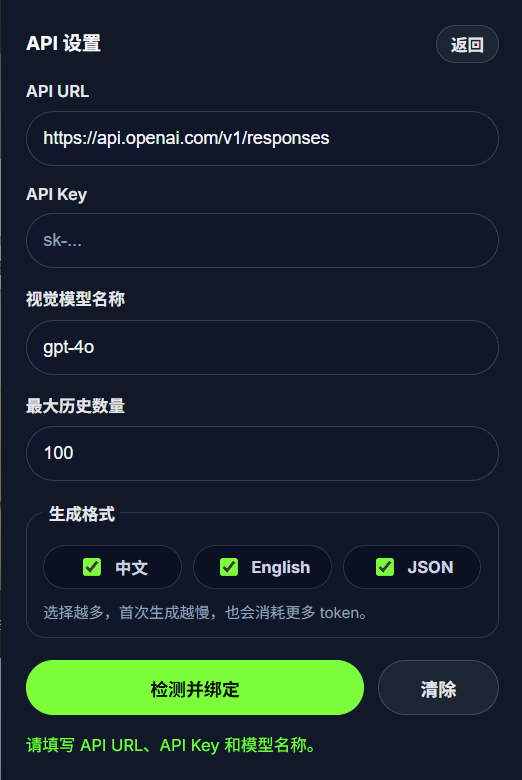
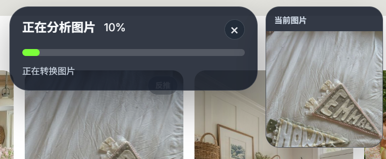
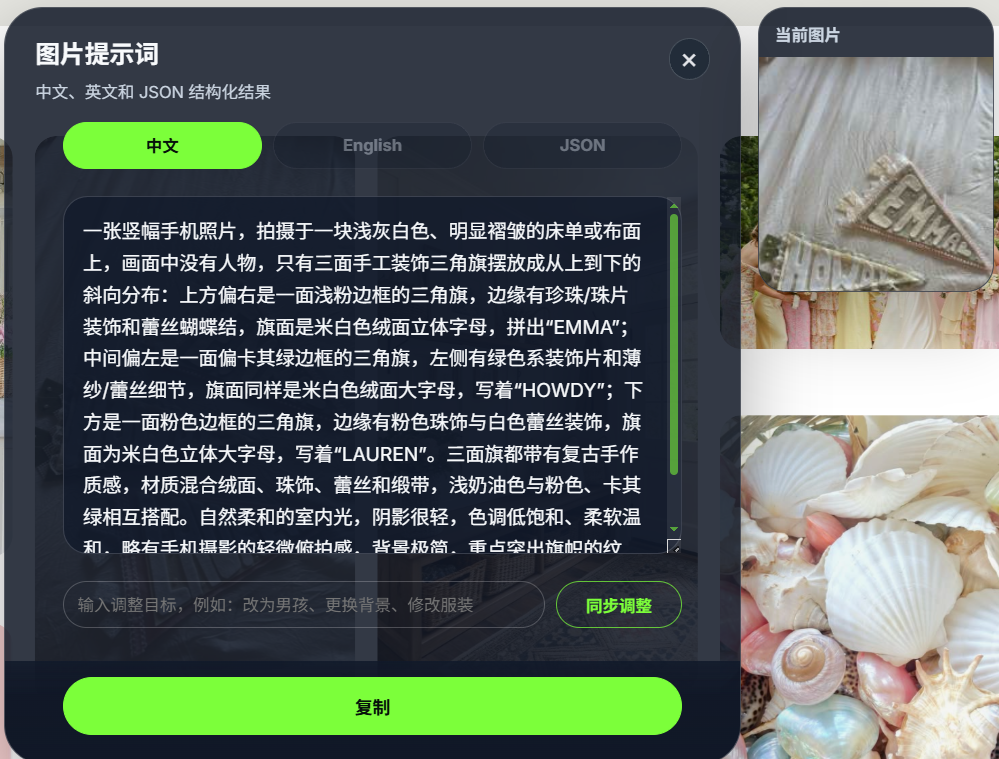

# 图片反推提示词


一个 Chrome / Edge 浏览器插件：右键网页图片，调用支持视觉输入的 AI 接口，反推出中文提示词、英文提示词和 JSON 结构化描述。

本项目是在 **B站「小小羊同学聊AI」分享的图片反推提示词插件** 基础上修改而来，主要增加了历史记录、IndexedDB 本地存储、导入导出、提示词同步调整、当前图片预览和界面优化等功能。

<p align="center">
  
</p>

## 软件界面预览

### 设置页面



### 加载扩展



### 反推结果



## 功能

- 右键网页图片，一键反推提示词。
- 输出中文、英文和 JSON 三种结果。
- 结果弹窗支持复制、切换格式、同步调整提示词。
- 弹窗旁显示当前正在反推的图片。
- 历史记录保存在本地 IndexedDB，默认最多 100 条。
- 历史记录支持中文、英文、JSON 分别复制。
- 点击历史缩略图可查看详情，并继续调整提示词。
- 支持历史记录 JSON 导入和导出。

## 安装

1. 下载或克隆本仓库。
2. 打开 Chrome / Edge 扩展管理页：`chrome://extensions/` 或 `edge://extensions/`。
3. 开启“开发者模式”。
4. 点击“加载已解压的扩展程序”。
5. 选择本项目文件夹。
6. 点击浏览器工具栏里的插件图标，填写 API URL、API Key 和模型名称。
7. 在网页图片上右键，选择“反推图片提示词”。

## API URL 示例

OpenAI Responses：

```text
https://api.openai.com/v1/responses
```

OpenAI-compatible Chat Completions：

```text
https://your-api-host.example.com/v1/chat/completions
```

Anthropic Messages：

```text
https://api.anthropic.com/v1/messages
```

如果填写的是域名根路径或 `/v1`，插件会尝试自动补全接口路径。第三方中转服务通常更适合填写 `/v1/chat/completions`。

## API Key 安全说明

代码仓库里 **没有内置任何 API Key**。页面里出现的 `sk-...` 只是输入框占位符，不是真实密钥。

插件对 API Key 的处理方式：

- API Key 由用户自己在插件设置里填写。
- API Key 保存在浏览器本地的 `chrome.storage.local`。
- API Key 不会写入项目文件，也不会提交到 GitHub。
- API Key 不会通过 `chrome.storage.sync` 同步到其他设备。
- 请求 AI 接口时，API Key 只会作为请求头发送给用户自己填写的 API URL。
- 如果旧版本曾把 API Key 存到 `chrome.storage.sync`，新版会自动迁移到 `chrome.storage.local` 并删除同步存储里的旧值。

需要注意：图片反推本身必须把图片内容发送给你配置的 AI 接口。请只在你信任的 API 服务中使用自己的 Key。

## 历史记录

历史记录保存在浏览器本地 IndexedDB 中。

默认最多保存 100 条。设置里的“最大历史数量”可以填写：

- `100`：默认值。
- 更大的数字：保存更多历史。
- `0`：不主动按数量清理。

导出会生成 JSON 文件，包含历史提示词、模型名、创建时间和缩略图。导入时会合并到本地历史库，并按当前最大历史数量清理超出的旧记录。

## 权限说明

| 权限 | 用途 |
| --- | --- |
| `contextMenus` | 在图片右键菜单中添加“反推图片提示词”。 |
| `activeTab` | 访问用户当前主动操作的标签页。 |
| `scripting` | 在需要时注入页面弹窗脚本。 |
| `storage` | 保存 API 设置、本地配置和历史迁移标记。 |
| `clipboardWrite` | 复制提示词到剪贴板。 |
| `<all_urls>` | 读取网页图片、处理跨域图片和显示页面内弹窗。 |

## 文件结构

```text
.
├── manifest.json
├── background.js
├── content.js
├── popup.html
├── popup.js
├── history-db.js
├── style.css
├── icons/
└── docs/
```

## 本地检查

这个项目没有构建步骤。修改文件后，在扩展管理页点击“重新加载”即可。

可以用下面的命令检查 JavaScript 语法：

```powershell
foreach ($file in @('history-db.js','background.js','popup.js','content.js')) { node --check $file }
```
